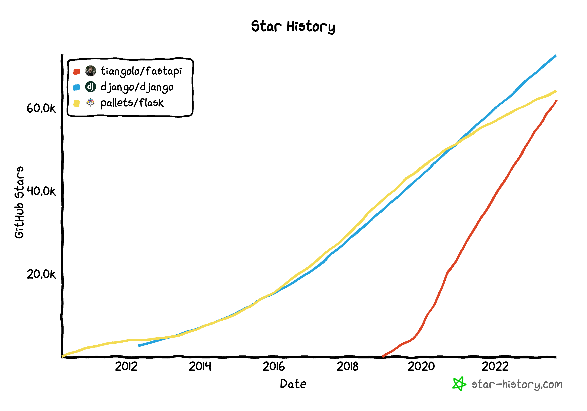

# The History of FastAPI

---

# About me

Marcelo Trylesinski

---

## FastAPI Expert

---

## OSS Maintainer

### Uvicorn

### Starlette

---

## Software Engineer at Pydantic

---

# The History of FastAPI

---

# Historical Context

---

# The Inspiration

---

# Star History

<!-- https://star-history.com/#tiangolo/fastapi&django/django&pallets/flask&Date -->

---

# Thank You!

<link rel="stylesheet" href="https://cdnjs.cloudflare.com/ajax/libs/font-awesome/5.15.3/css/all.min.css" integrity="sha512-iBBXm8fW90+nuLcSKlbmrPcLa0OT92xO1BIsZ+ywDWZCvqsWgccV3gFoRBv0z+8dLJgyAHIhR35VZc2oM/gI1w==" crossorigin="anonymous" referrerpolicy="no-referrer" />

<i class="fab fa-linkedin"></i> Marcelo Trylesinski
<i class="fab fa-twitter"></i> @marcelotryle
<i class="fab fa-github"></i> Kludex
