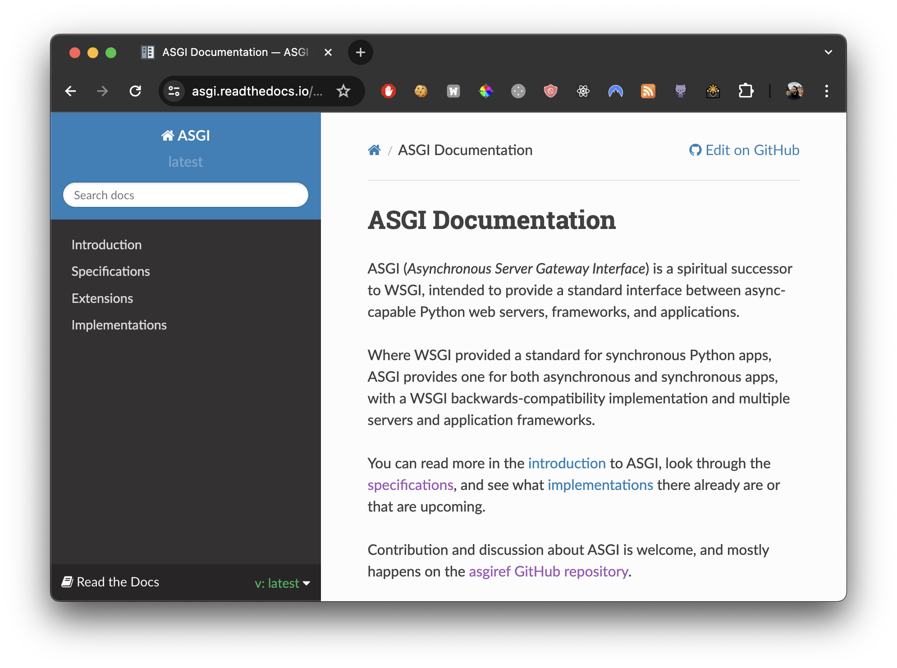
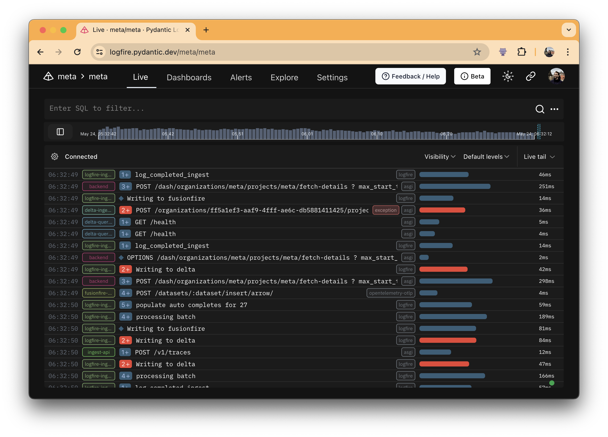

# Unlocking ASGI Innovations

## How FastAPI Reaps the Benefits

---

## The Speaker

<!-- 
 -->

Marcelo Trylesinski

---

## OSS Maintainer

### Uvicorn

### Starlette

<!-- Reference: https://github.com/koddr/starlette-logo -->

---

## What is ASGI?

<!--
ASGI stands for Asynchronous Server Gateway Interface.

The specification specifies how the server and the application should communicate.

It allows developers to implement their own blocks of packages i.e. we can develop separately the web framework
and the server.

The specification was inspired by WSGI, the non-async predecessor of ASGI. Which Django and Flask are based on.
There's also a Python package called `wsgiref`.
-->

---

## What is ASGI?

<!--
As I mentioned, the specification defines how the server and the application communicate.

To do that, we need a common interface that both can understand, and that's what you are seeing in this slide.

The "scope" contains the information about the connection, and can be one of those three types: lifespan, http or websocket.
The "receive" is used by the application to receive events from the server.
The "send" is used by the application to send events to the server.
-->

---

## Why FastAPI follows ASGI?

<!-- TODO: Add a starlette image... -->

<!--
FastAPI is a subclass of Starlette, and Starlette follows ASGI.

In other words, FastAPI doesn't have an option.

Now, if you ask why Starlette follows ASGI... Well, Tom Christie, the creator, was involved when
the ASGI specification was being created. So it makes sense for Starlette to be built following that interface.

Also, Starlette was created a bit after Uvicorn, which was one of the first ASGI servers. Uvicorn was also built by
Tom Christie.
-->

---

## WebSocket Denial Response

<!--
Ask the audience if they know what the client will receive after it calls this endpoint.

The return will be a 403 status code.
-->

---

## WebSocket Denial Response

<!--
What is this? Ask the audience who has seen this before...
-->

---

## WebSocket Denial Response

<!--
This is how it will be possible when FastAPI supports Starlette 0.42.0 released two days ago...
When I noticed it was not supported, and I was creating those slides.
-->

---

## WebSocket Denial Response

---

## HTTP Trailers

<!--
Explain what are HTTP trailers.

Mention the most common HTTP Trailers that exist:
- content-length on streaming responses.
- time it took for a request/response to run.
- ???
-->

---

## HTTP Trailers

<!-- This is the simplest ASGI application that uses HTTP Trailers. -->

---

## HTTP Trailers

What about FastAPI?

---

## HTTP Trailers

<!-- TODO: Add the old pull request where I implemented the HTTP trailers, but decided to not merge. -->

<!--
FastAPI users can benefit from it if they implement it by themselves.

To be fair, if you come up with the idea of using HTTP Trailers, you probably are senior enough to implement it.
I only found out about them when I created the ASGI extension (I'm the creator of it btw).
-->

---

## HTTP Trailers

Open Source!

<!-- Just give the public the idea to develop `asgi-trailers`. -->

---

## Client Disconnection

<!-- TODO: Add a screenshot about the `http.disconnect` receive message. -->

<!-- Talk about the specification, and the problems we faced with the current way. -->

---

---

## Client Disconnection

<!-- I need to explain how it simplifies the implementation. -->

---

## Client Disconnection

---

## Client Disconnection

Uvicorn raises `OSError` on... WebSockets!

<!-- TODO: Find PRs where I implement in HTTP, and reverted! -->

<!--
You can already benefit from it on FastAPI's side, because Starlette already checks for IOError.

But only on the WebSockets side... I tried to change the implementation on HTTP side, but...
-->

---

## Client Disconnection

---

## Client Disconnection

Next steps...

<!--
The next steps are to support HTTP, and implement it on Starlette, and FastAPI
will be able to benefit from it without doing anything.
-->

---

## Conclusion

<!--
What the fuck is the conclusion?
-->

---

## Bonus: FastAPI Tips

https://github.com/Kludex/fastapi-tips

---

## Try Logfire (PYCONPT2024)! 🚀

---

# Thank You!

[www.fastapiexpert.com](https://www.fastapiexpert.com)

<i class="fab fa-linkedin"></i> Marcelo Trylesinski
<i class="fab fa-twitter"></i> @marcelotryle
<i class="fab fa-github"></i> Kludex
