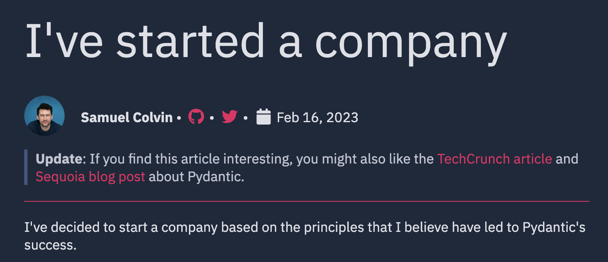

# How the duck those packages work?

---

# About me

Marcelo Trylesinski

---

## FastAPI Expert

---

## OSS Maintainer

### Uvicorn

### Starlette

<!-- Reference: https://github.com/koddr/starlette-logo -->

---

## Software Engineer at Pydantic

---

# Motivation

<!--
So... For those who don't know me... I work fully remote, and every day I go to this coffee place that is around 5 minutes bike
from my home.

And... I asked the barista that works there to go out.

We went out, and at some point I told her that "I do Open Source".
I explained what open source is...
- "I'm kind a communist on the code world."
- "People contribute to public projects."
- "Everybody use these makes use of those projects."
Then I tried to explain specifically what I do in a nice way... I started with:
  "Yeah, you know... I kind a build the tools that people use to build real stuff"
She was a bit confused, and said "I understand, I guess."

I don't think she did.

We are not going out anymore.

Not for those reasons, but... Talking to her gave me the idea for this talk.

It made me think about how can I explain in a nice way what I really know to others.
Also, this is a subject that really excites me, since it touches a lot of packages in the ecosystem.

Besides, I've only met nice people from India. So I dedicated a bit more of myself to this.
Hope you enjoy this talk, as much as I enjoy your company.
-->

---

# Understand how things are connected

This is the goal for today!

---

<!-- Talk about Uvicorn (web server), FastAPI (web framework), and the client. -->

---

# Who is the server?

<!-- An image of Uvicorn. Also, explain what Uvicorn is. -->
<!-- Uvicorn is a server implementation that runs applications that look like FastAPI. -->

---

# Let's learn how things happen!

---

# Client initiates the connection

<!-- At the first moment, a 3-way TCP handshake is established, and then maybe a TLS handshake as well. -->

---

# Server creates a task (connection)

<!-- When I say the server, here I'll always mean Uvicorn. -->
<!-- Creates an object for that connection. -->
<!-- Show the uvicorn code -->
<!-- Explain that TCP handshake, and TLS handshake happens. -->

---

# Uvicorn implements `asyncio.Protocol`

---

# `connection_made` is called

https://docs.python.org/3/library/asyncio-protocol.html#asyncio.BaseProtocol.connection_made

---

# `data_receive` is called

https://docs.python.org/3/library/asyncio-protocol.html#asyncio.Protocol.data_received

<!-- The request will be received by the task. -->

---

# `h11` is a Sans-IO protocol library

# `httptools` is a callback based library

---

# Server will receive the request

<!-- Show a picture of: Request line + Headers + CR line + body
-->

<!-- - Request line (method, path, query)
- HTTP headers -->

---

# Two things can happen

## 1. Create the "HTTP connection Scope"
## 2. Upgrade the connection

---

# Create the "HTTP connection Scope"

`headers`, `path`, `method`, `query_string`, etc.

https://asgi.readthedocs.io/en/latest/specs/www.html#http-connection-scope

<!-- It's just to create the scope. See how the scope looks like. -->

---

# Or... Server will upgrade the connection

<!-- Meaning it can be upgraded to WebSockets. Then the WebSocket scope will be created. -->
<!-- Or HTTP/2 -->

---

# Server will run the application

<!-- Show the `run_asgi` method in Uvicorn. -->
<!-- Each request means that the application is ran. Meaning that `FastAPI().__call__` is called. -->

---

# Server will communicate with the application via ASGI events

---

# What's ASGI?

<!-- Asynchronous Server Gateway Interface -->

<!-- It's the WSGI successor. But... I don't know much about WSGI. I don't have many years of experience. -->

https://asgi.readthedocs.io/en/latest/

---

# Simple ASGI application

---

# Echo ASGI application

---

# FastAPI is an ASGI application

---

# FastAPI is an ASGI application

---

# Starlette is an ASGI application

---

# Middleware & ASGI Application

---

# Middleware & ASGI Application

---

# Starlette does the routing

`Starlette` -> `Router` -> `Route`

---

# The endpoint is called

---

# Dependency Injection

---

# The data is validated

---

# What is Pydantic?

---

# Come to me to get my card, to get early access to the product we are building!

---

# Endpoint function runs

---

# Data will be validated on output

---

# Middlewares again

Remember?

---

# The application sends events to the ASGI server

---

# ASGI server makes sure the ASGI application complies to the spec

---

# Server sends data to the client

---

# What now?

---

# Task will stay alive for a while

<!-- Depends on the keep alive timeout. -->

---

# Connection object is closed

---

# That's it!

---

# Support for WebSockets

---

# Support for Lifespan Events

---

# What happens on shutdown?

<!-- Is there time to talk about it? -->
<!-- Is it even worth it? -->

---

# Where to go from here?

1. Help on issues
2. Watch your favorite packages on GitHub

<!-- Help on issues! -->
<!-- Watch your favorite packages on GitHub.  -->
<!-- Things don't happen overnight. It takes time to get really good at something. Be patient. -->

---

# Predicting questions...

Starlette/FastAPI/Uvicorn V1

---

# Predicting questions...

Will you come to India if you get invited next year?

---

Yes.

---

# Thank You!

[FastAPIExpert.com](https://www.fastapiexpert.com)

<link rel="stylesheet" href="https://cdnjs.cloudflare.com/ajax/libs/font-awesome/5.15.3/css/all.min.css" integrity="sha512-iBBXm8fW90+nuLcSKlbmrPcLa0OT92xO1BIsZ+ywDWZCvqsWgccV3gFoRBv0z+8dLJgyAHIhR35VZc2oM/gI1w==" crossorigin="anonymous" referrerpolicy="no-referrer" />

<i class="fab fa-linkedin"></i> Marcelo Trylesinski
<i class="fab fa-twitter"></i> @marcelotryle
<i class="fab fa-github"></i> Kludex
