# FastAPI Internals

---

## The Speaker


<!-- 
 -->

Marcelo Trylesinski

---

## OSS Maintainer

<div class="columns">
<div>

### Uvicorn


</div>
<div>

### Starlette


<!-- Reference: https://github.com/koddr/starlette-logo -->

</div>
</div>

---

## What is FastAPI?

<!-- FastAPI is a web framework. -->

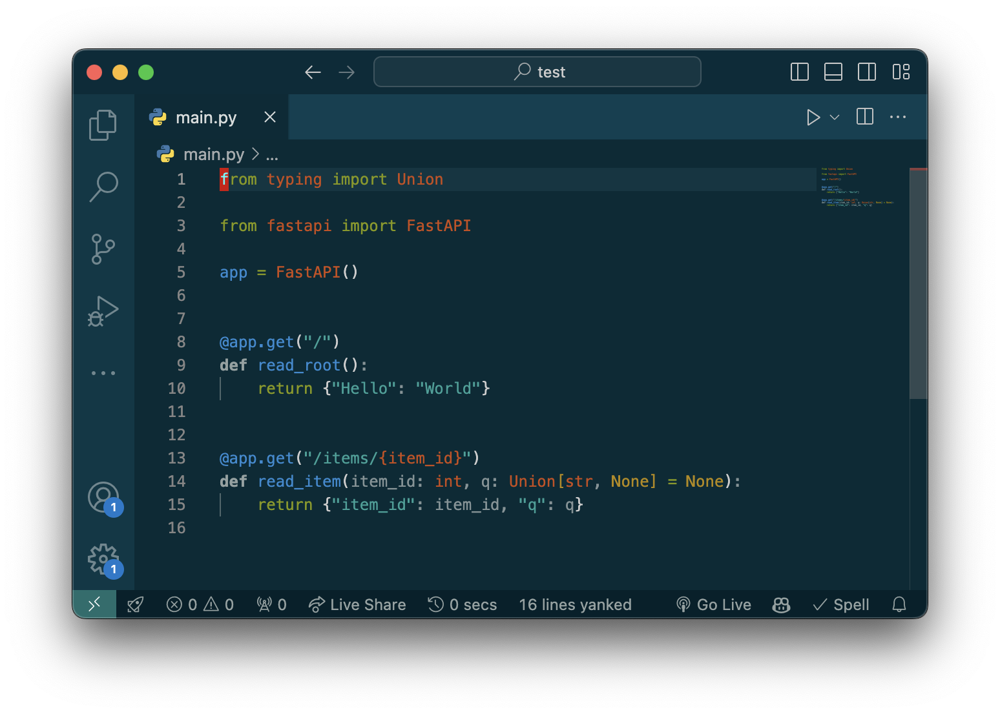

---

## How do I run FastAPI?

`uvicorn main:app` or...

[www.uvicorn.org]()

<!-- Uvicorn was built by Tom Christie, the same author as
MkDocs, Starlette, HTTPX and Django Rest Framework. -->

---

## How do I run FastAPI?

`hypercorn main:app` or...

[github.com/pgjones/hypercorn]()

<!-- Hypercorn was built by Phil Jones, one of the Flask
maintainers.  -->

---

## How do I run FastAPI?

`granian main:app`

[github.com/emmett-framework/granian]()

<!-- Granian was built by an Italian - which is in the room. -->

---

## How the interactions happen?


<!-- The client initiates the communication, and the server
parses the HTTP request. Then the server sends the information
to the application in a specific format. -->

---


## Let's focus on...


---

## But... How it really happens?


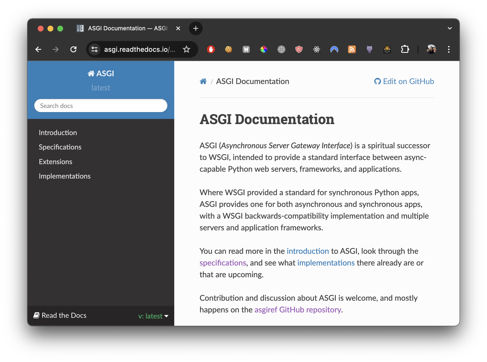

---

## ASGI application

```python
Scope = Dict[str, Any]
Receive = Callable[[], Awaitable[Dict[str, Any]]]
Send = Callable[[Dict[str, Any]], Awaitable[None]]

async def app(scope: Scope, receive: Receive, send: Send):
    ...
```

<!-- ASGI is the interface between the server and the application. -->

---

## Simplest ASGI application

```py
async def app(scope, receive, send):
    body = b"Hello world!"
    headers = [(b"content-type", b"text/plain"), (b"content-length", str(len(body)).encode())]

    await send({"type": "http.response.start", "status": 200, "headers": headers})
    await send({"type": "http.response.body", "body": body})
```

---

## After the connection is established...

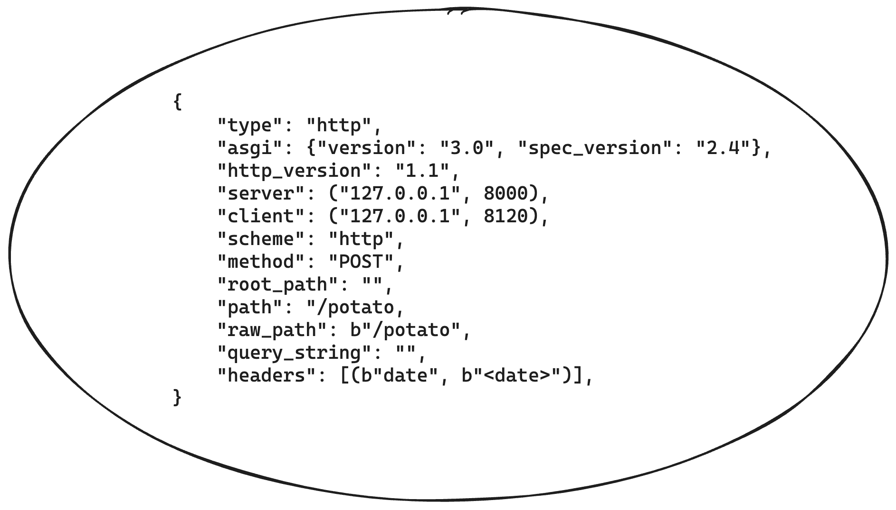

<!-- And the request line is read... -->

---

## If the client sends a body...

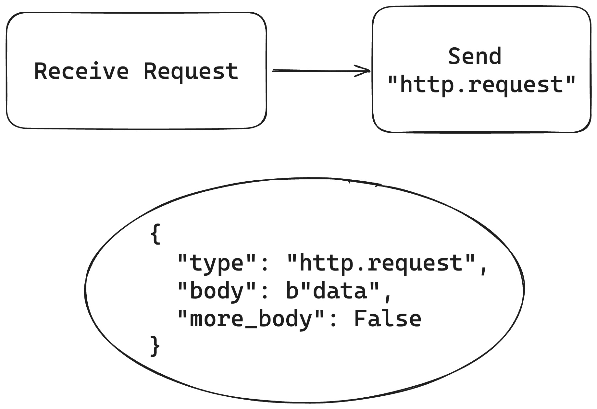

---

## Then... It's the application's turn!

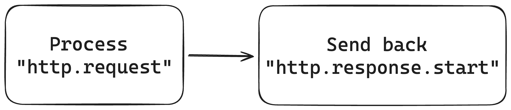

---

## Middleware Stack


<!-- The middleware intercepts the messages sent by the server, and the application. -->

---

## Middleware Stack

```py
from fastapi import FastAPI
from src.middleware import CustomMiddleware, AnotherCustomMiddleware

app = FastAPI()
app.add_middleware(CustomMiddleware)
app.add_middleware(AnotherCustomMiddleware)
```

---

## Middleware Stack

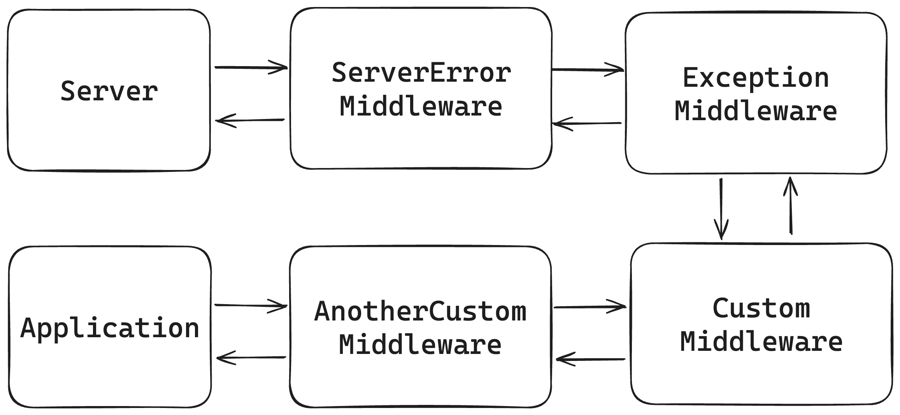

---

## Routing

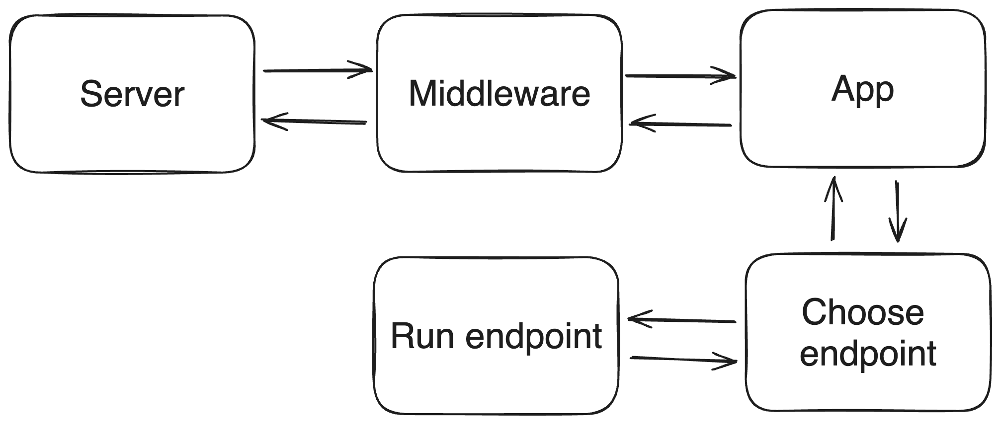

---

## Routing

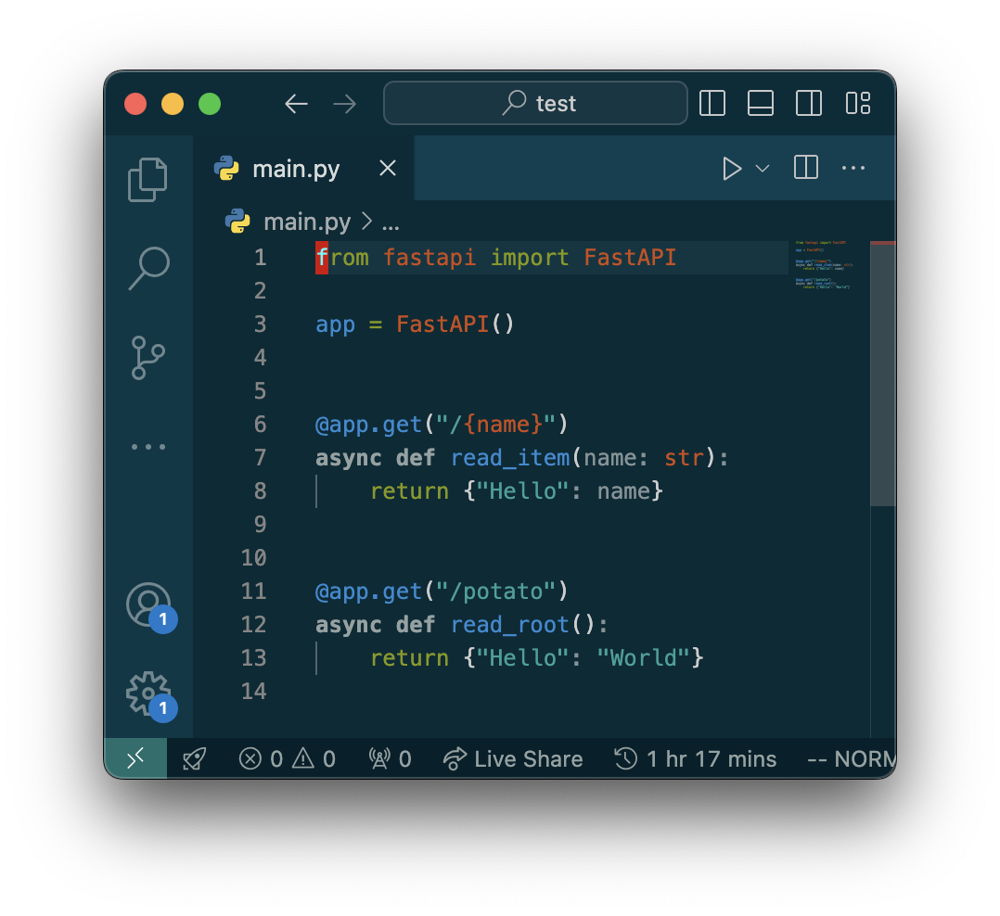

---

### Dependency Injection

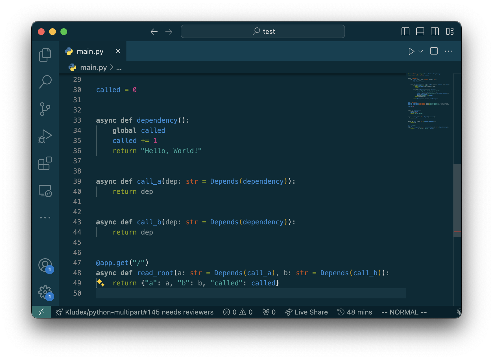

---

## Dependency Injection

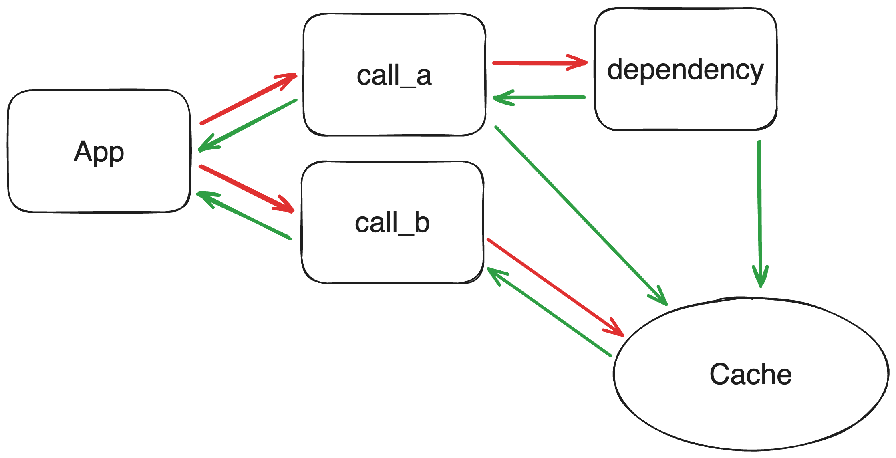

---

## Dependency Injection

<div class="columns">
<div>

### Async

```py
async def dependency():
    return "Hello, World!"
```

</div>
<div>

### Sync

```py
def dependency():
    return "Hello, World!"
```

<div>
</div>

---

## Input/Output Validation

```py
from fastapi import FastAPI
from pydantic import BaseModel

app = FastAPI()

class Input(BaseModel):
    name: str
    age: int

class Output(Input):
    id: int

@app.post("/")
async def read_item(input: Input) -> Output:
    return await database_insert(input)
```

---

## Input/Output Validation

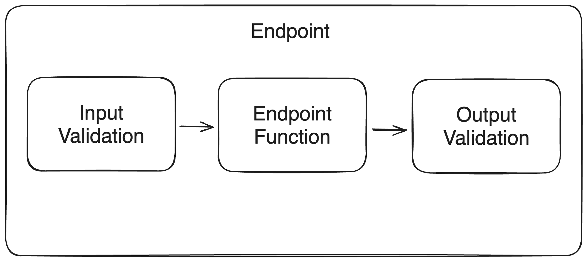

---

## WebSockets

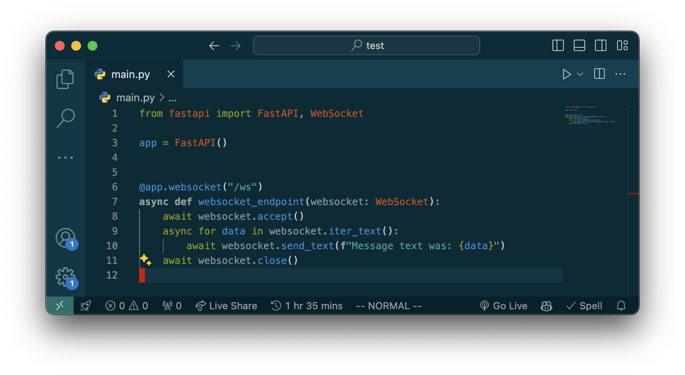

<!-- It comes from Starlette. -->

---

## WebSockets

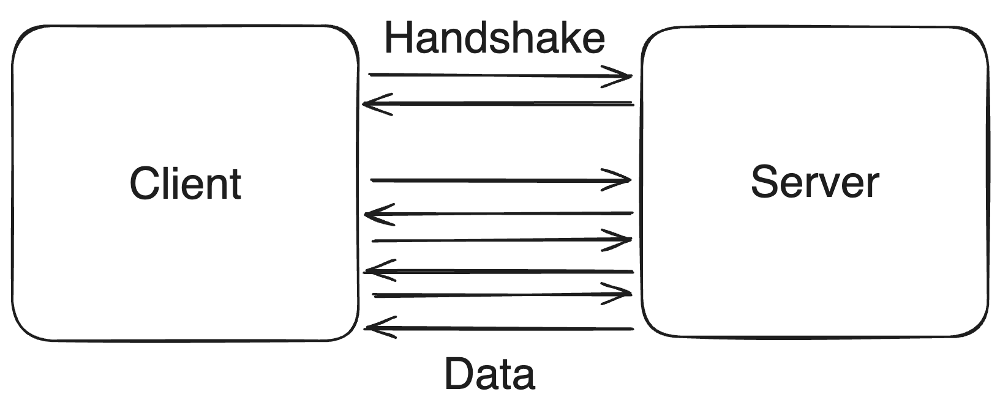

---

## Async vs Sync

When should I use...

<!--
When to use non-async code?
- CPU bound that can escape the GIL
- Thread blocking IO
 -->

---

## Bonus: FastAPI Tips

https://github.com/Kludex/fastapi-tips

---

## Try Logfire! 🚀

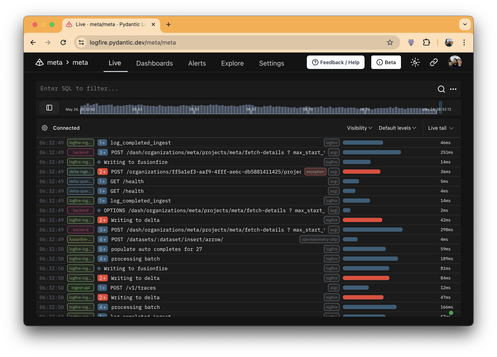

---

# Thank You!

[www.fastapiexpert.com](https://www.fastapiexpert.com)

<link rel="stylesheet" href="https://cdnjs.cloudflare.com/ajax/libs/font-awesome/5.15.3/css/all.min.css" integrity="sha512-iBBXm8fW90+nuLcSKlbmrPcLa0OT92xO1BIsZ+ywDWZCvqsWgccV3gFoRBv0z+8dLJgyAHIhR35VZc2oM/gI1w==" crossorigin="anonymous" referrerpolicy="no-referrer" />


<i class="fab fa-linkedin"></i> Marcelo Trylesinski
<i class="fab fa-twitter"></i> @marcelotryle
<i class="fab fa-github"></i> Kludex
