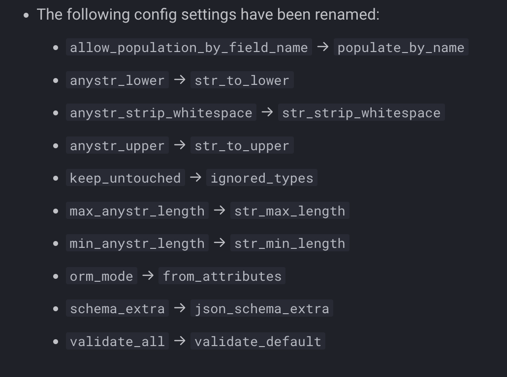

# The validation evolution
# Pydantic V2tronger

---

# About me

Marcelo Trylesinski

---

## FastAPI Expert

---

## OSS Maintainer

### Uvicorn

### Starlette

<!-- Reference: https://github.com/koddr/starlette-logo -->

---

## Software Engineer at Pydantic

---

# What is Pydantic?

---

# What is Pydantic?

---

# What's this talk about?

<!-- Explain that I'm going to go through some Pydantic features, and explain why/how they changed. -->

---

# Why did we create V2?

<!-- Explain why V2 was released. -->

---

# Pydantic Core

github.com/pydantic/pydantic-core

---

# Let's go through some changes

---

# `Config` -> `model_config`

---

# `Config` -> `model_config`

---

# Which settings changed?

<!-- Explain or show things that were deprecated/removed/changed on the `Config`. Explain also the reason for it. -->

---

# Changes on validators

## `@validator` -> `@field_validator`

---

# Changes on validators

## `@validator` -> `@field_validator`

---

# Validation mode (`before`)

---

# Validation mode (`before`)

---

# Validation mode (`wrap`)

---

# Validation mode (`after`)

---

# Changes on validators

## `@root_validator` -> `@model_validator`

---

# `__root__` -> `RootModel`

---

# `__root__` -> `RootModel`

---

# `TypeAdapter`

---

# `pydantic.BaseSettings` -> `pydantic_settings.BaseSettings`

github.com/pydantic/pydantic-settings

---

# Modify the JSON schema

---

# Modify the JSON schema

---

# Custom Types

<!-- This is the Pydantic protocol - other packages should implement this. -->

---

# Custom Types

---

# Pydantic Extra Types

<!-- Uncertain policy to what gets in yet. Packages should be able to use the Pydantic protocol. -->
https://github.com/pydantic/pydantic-extra-types

---

# Performance Tips

<!-- Use the Pydantic documentation page to explain this one. -->
Use `model_validate_json()`, and not `model_validate(json.loads())`

---

# Performance Tips

`TypeAdapter` instantiated once

---

# Performance Tips

`TypeAdapter` instantiated once

---

# Performance Tips

Don't do validation when you don't have to - use `Any`

---

# Performance Tips

Use `Literal`, not `Enum`

---

# Performance Tips

Use `TypedDict` over nested models

---

# Performance Tips

https://docs.pydantic.dev/latest/concepts/performance

---

# Is V3 planned?

<!-- Explain that at some point next year we are going to have the next major. But... The changes are changes
are going to be far less disruptive in comparison to V1->V2. -->

---

# Where to see more about it?

https://docs.pydantic.dev/latest/migration/

---

# Early Access to our Product!

Talk to me to get my business card.

---

# Follow me on YouTube

The FastAPI Expert

---

# Thank You!

[FastAPIExpert.com](https://www.fastapiexpert.com)

<link rel="stylesheet" href="https://cdnjs.cloudflare.com/ajax/libs/font-awesome/5.15.3/css/all.min.css" integrity="sha512-iBBXm8fW90+nuLcSKlbmrPcLa0OT92xO1BIsZ+ywDWZCvqsWgccV3gFoRBv0z+8dLJgyAHIhR35VZc2oM/gI1w==" crossorigin="anonymous" referrerpolicy="no-referrer" />

<i class="fab fa-linkedin"></i> Marcelo Trylesinski
<i class="fab fa-twitter"></i> @marcelotryle
<i class="fab fa-github"></i> Kludex
